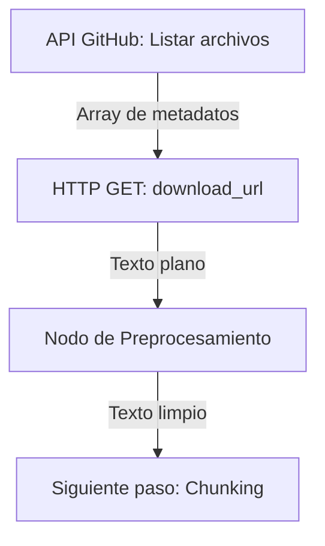
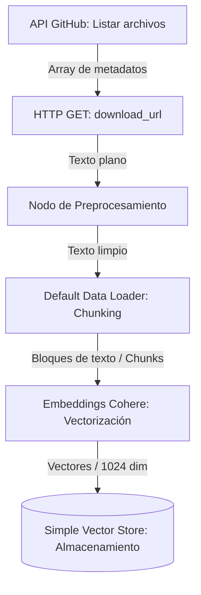
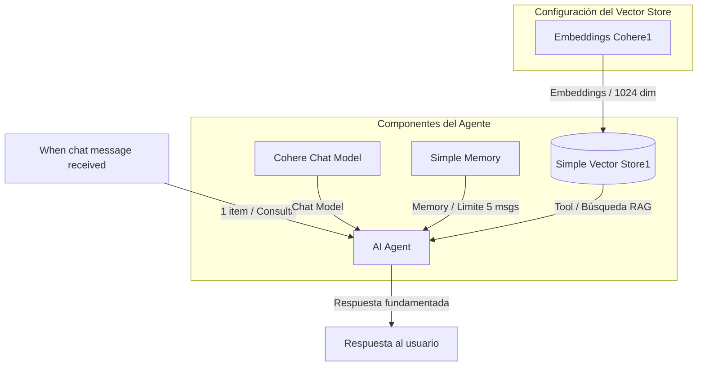
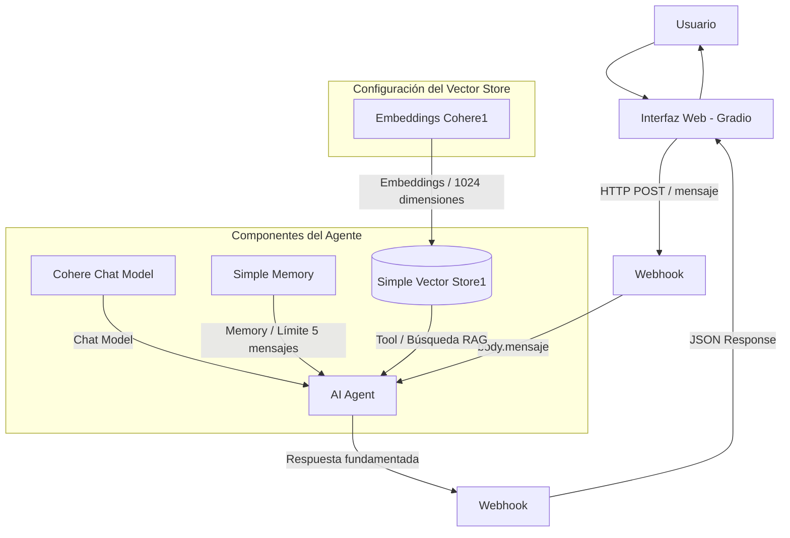

# Journal de Desarrollo | RAG Onboarding

## 1. Creación de Documentación Ficticia

* **Fecha:** 25 de julio de 2026
* **Estado:** Completado

---

### Objetivo
Crear un repositorio de documentación estandarizado que sirva como referencia y base de conocimiento para la entrada del RAG.

---

### Decisión
Se optó por generar la documentación mediante IA (Kimi K2.6) para simular el contexto de una empresa ficticia ("Fictional Entertainment MX"), abarcando misión, valores, políticas internas y arquitectura técnica. Esto permite probar el pipeline con datos estructurados sin comprometer información sensible.

---

## 2. Extracción y Limpieza de Documentación (Carpeta `data`)

* **Fecha:** 26 de julio de 2026
* **Estado:** Completado

---

### Objetivo
Automatizar la recolección de los documentos de onboarding almacenados en el repositorio de GitHub, descargarlos en texto plano y aplicar un preprocesamiento que elimine ruido antes de la fase de vectorización semántica.

---

### Detalles Técnicos del Nodo de Preprocesamiento para Cada Elemento
* Eliminación de metadatos irrelevantes y sintaxis innecesaria.
* Normalización de texto (Remoción de espacios/saltos dobles).

---

### Flujo

## 3. Elección Simple vector storage, Model Embeddings y Loader 

* **Fecha:** 26 de julio de 2026
* **Estado:** Completado

---

### Decisión

#### Simple Vector Store:

**Simplicidad y Bajas Latencias:** Dado que esta herramienta nativa de n8n simplifica el desarrollo para este proyecto, no se requiere de un almacenamiento de vectores externo. Además, gracias a que este corre en memoria, reduce la latencia de las consultas a proveedores externos.

#### Embeddings de Cohere (`embed-multilingual-v3.0 (1024 Dimensiones)`):

**Multilingüe:** Este modelo soporta embeddings en español, lo cual es vital para que el proyecto funcione, ya que la información del repositorio se encuentra en este lenguaje.  
**Dimensión:** Nos brinda un excelente balance entre precisión semántica (*retrieval recall*) y costo computacional.

#### Default Data Loader:

**Estandarización del Chunking:** Garantiza una segmentación uniforme del contenido Markdown.

### Flujo

---

## 4. Prompt para Agente de IA

* **Fecha:** 26 de julio de 2026
* **Estado:** Completado

---

### Objetivo

Crear un prompt que se alinee con los objetivos de la empresa y con su cultura, y que ayude a los desarrolladores que buscan documentación.

---

### Decisión
Se crea un prompt para brindarle un tono de apoyo y alineado con los valores de la empresa. Se le otorga la libertad al agente de enlazar respuestas y ofrecer una que haga sentido con la documentación disponible. No se le brindará libertad para dar información que no se encuentre en el repositorio.

## 5. Elección Chat Model y Memoria.

* **Fecha:** 26 de julio de 2026
* **Estado:** Completado

---

### Decisión

#### Cohere Chat Model (`command-a-03-2025`):

**Compatibilidad:** Se prioriza la compatibilidad con el embedding, que es del mismo modelo.
**Versión:** Nos brinda más contexto e información reciente; aunque existe uno más actualizado `command-a-plus-05-2026`, actualmente no está disponible para pruebas.
**Ventana de contexto:** Cohere command-a-03-2025 nos da una ventana de contexto generosa (256,000 tokens) que es ideal para este tipo de escenarios, en donde se podrían consultar múltiples documentos para dar una respuesta coherente y fundamentada.

#### Almacenmiento:

**Memoria simpre:** Se eligió este tipo de memoria para mantener simple el proyecto. Esta memoria se almacena en memoria RAM, pero podría ser sustituida por otras herramientas para mantener el flujo de chat. Además, esta memoria está limitada a 5 mensajes para no saturar la RAM, por lo que la IA perderá el contexto de manera fácil.

### Flujo

## 6. Interfaz de chat y webhook

* **Fecha:** 26 de julio de 2026
* **Estado:** Completado

---

### Decisión

**Versión 2 de flujo 2:** Se creará una nueva version para crear un Webhook para que sea disponible con mensajes fuera de n8n.

**Interfaz Web:** Se utilizará Gradio para desarrollar una interfaz gráfica rápida y funcional, tomando como base la lógica del proyecto CHATBOT (Gokul-Raja84). El diseño visual y los estilos aplicarán el tema Material Design RD de d8ahazard.

**Integración:** La interfaz enviará las peticiones vía HTTP POST hacia un Webhook, el cual extraerá el texto del usuario desde {{ $json.body.mensaje }} para detonar la ejecución del Agente de IA.

### Flujo

