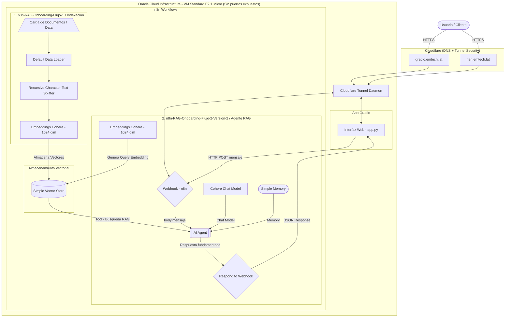
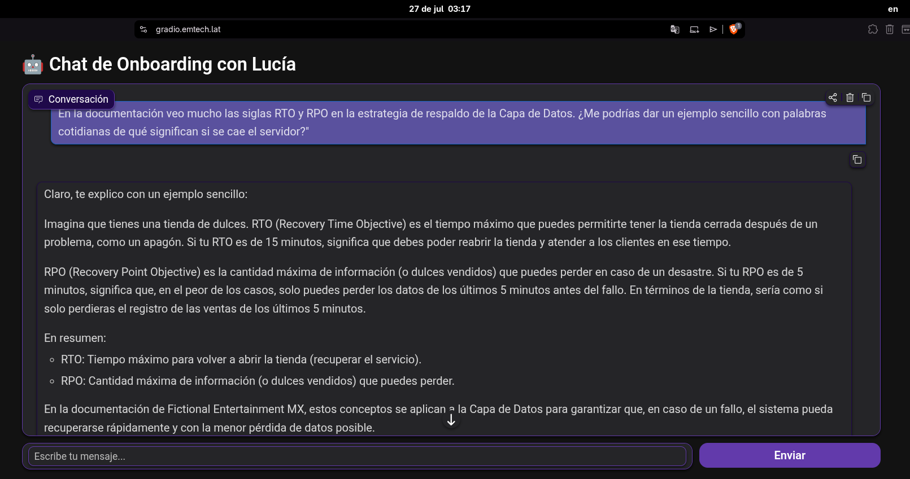
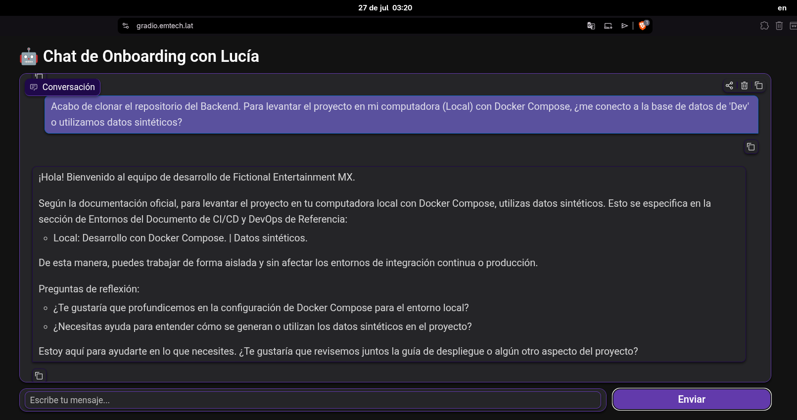
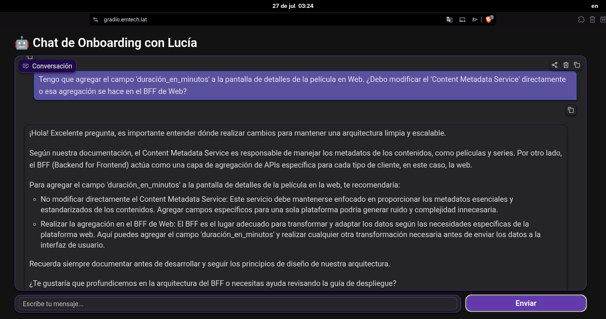
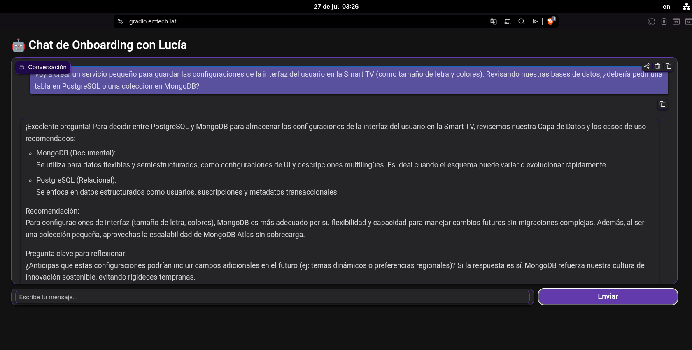
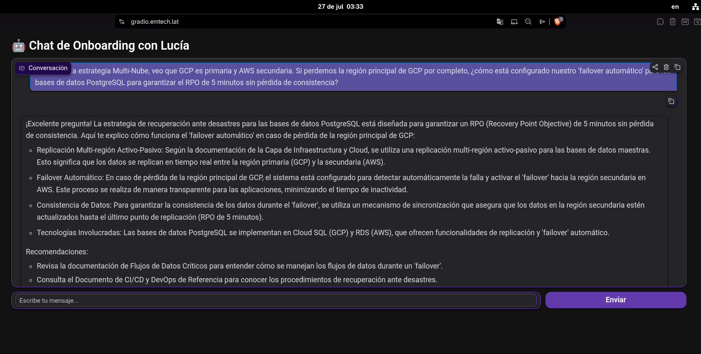
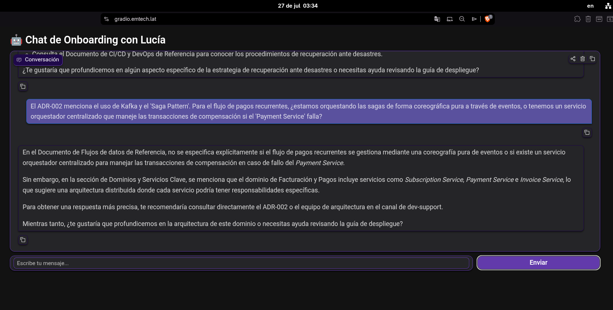

# RAG para Onboarding de Desarrolladores

## 1. Descripción

### 1.1. El problema

El onboarding de desarrolladores consiste en que un nuevo integrante comprenda la documentación, las decisiones técnicas y los procesos de la empresa. Cuando la información es difícil de encontrar o la capacitación no resuelve todas las dudas, el desarrollador invierte más tiempo buscando respuestas, lo que aumenta su carga cognitiva, el estrés y retrasa su productividad. Una documentación clara y accesible facilita la transferencia de conocimiento y reduce el tiempo necesario para incorporarse a un proyecto [1][2].

Estos retrasos afectan tanto a la empresa como al cliente. La empresa pierde tiempo y recursos, reduce su capacidad para atender nuevos proyectos y aumenta el riesgo de incumplimientos. Por su parte, el cliente puede recibir un producto que no cumpla con sus expectativas debido a una mala interpretación de los requisitos. Además, otros miembros del equipo, como analistas de sistemas y arquitectos de software, dedican parte de su tiempo a responder preguntas repetitivas en lugar de enfocarse en tareas de mayor valor.

### 1.2. Alcance del proyecto

- **Qué hará:** Responder dudas técnicas basadas estrictamente en tres documentos Markdown de prueba (por ejemplo: arquitectura, cultura y despliegue).
- **Qué NO hará:** No se conectará a APIs externas (Jira, Slack), no buscará en internet y se limitará a la documentación provista en la carpeta `data` de este repositorio.
- **Criterios de éxito:** El sistema debe procesar los documentos y responder preguntas con precisión y de forma entendible, indicando cuando no conoce la respuesta para minimizar las alucinaciones.

---

### 2. Arquitectura

#### 2.1. Componentes Clave

- **Infraestructura & Seguridad:** Alojado en Oracle Cloud (OCI) sin puertos abiertos a Internet. La conectividad segura se gestiona con Cloudflare Tunnels y dominios HTTPS personalizados.

- **Ingesta de Datos (Flujo 1):** Procesa documentos de la carpeta `data` de este reositorio (puede aplicarse a otras herramientas de documentación Como Jira, Notion, etc.), genera embeddings de 1024 dimensiones con Cohere y los almacena en un Simple Vector Store.

- **Agente RAG (Flujo 2 - Versión 2):** n8n orquesta la comunicación entre la interfaz web (Gradio) y el agente de IA (Cohere Chat), recuperando contexto relevante de la vector DB e historial de conversación para generar respuestas fundamentadas.



---

### 3. Tecnologías y herramientas utilizadas (Decisiones de elección en `JOURNAL.md`)

#### Infraestructura & Redes
* **Dominios personalizados:** `gradio.emtech.lat` (UI) y `n8n.emtech.lat` (Workflows).
* **Oracle Cloud Infrastructure (OCI):** Servidor GNU/Linux con ubuntu 22.04 minimal en la nube (**VM.Standard.E2.1.Micro**).
* **Cloudflare:** Gestión de DNS, certificados SSL/HTTPS y seguridad web.
* **Cloudflare Tunnel (`cloudflared`):** Exposición segura de servicios locales a Internet sin abrir puertos en el firewall.

#### Inteligencia Artificial & RAG
* **Cohere API:**
  * **Chat Model:** LLM encargado de procesar el contexto y redactar las respuestas.
  * **Embeddings (1024 dim):** Vectorización de texto para búsqueda semántica.
* **Recursive Character Text Splitter:** Fragmentación inteligente de textos.
* **Simple Vector Store:** Base de datos vectorial para almacenamiento e indexación.
* **Simple Memory:** Mantenimiento del contexto de conversación del agente.

#### Orquestación & Frontend
* **n8n:** Orquestador de flujos de trabajo (agente de IA, gestión de memoria e ingesta).
* **Gradio (`Python`):** Interfaz gráfica web para la interacción del usuario.

#### Fuentes de Datos e Integraciones
* **GitHub API (`HTTP GET`):** Extracción automatizada de documentos de la carpeta `data` de este repositorios para la ingesta de datos.

#### Comunicación
* **REST API & Webhooks:** Intercambio de peticiones `HTTP POST` / `GET` y payloads `JSON` entre componentes.

---

### 4. Instrucciones para ejecutar el proyecto

#### 4.1. Requisitos Previos

Antes de comenzar, asegúrate de contar con las siguientes credenciales y herramientas instaladas:

* **Cuenta en Cohere:** API Key activa para habilitar los modelos de Embeddings (`embed-multilingual-v3.0`) y Chat (`command-a-03-2025`).
* **Docker y Docker Compose:** Instalados en tu máquina local o en el VPS para desplegar las instancias de n8n.
* **Python 3.10+:** Para la ejecución de la interfaz gráfica desarrollada en Gradio (`app.py`).
* **Cuenta en Cloudflare (Solo para despliegue OCI):** Dominio propio y acceso a Cloudflare Zero Trust para la creación de túneles seguros (`cloudflared`).

#### 4.2. Proyecto local en n8n

1. Descargar los archivos: `n8n-RAG-Onboarding-Flujo-1.json` y `n8n-RAG-Onboarding-Flujo-2.json`
2. Agregarlos en n8n y coloca credenciales de cohere.
3. Ejecutar el flujo 1.
4. Empezar a preguntar a Lucía tus preguntas en el chat de n8n del flujo 2

#### 4.3. Proyecto en nube OCI con VM.Standard.E2.1.Micro

1. Crear una instancia VM.Standard.E2.1.Micro con una distribución ubuntu 22.04 minimal
2. Seguir los siguientes comandos de "Configurar n8n".

<details>
<summary><b>🔍 Ver comandos de configuración del servidor (SWAP y Docker)</b></summary>

##### 1. Crear memoria Swap (2 GB)

Si tu servidor tiene poca memoria RAM (por ejemplo, 1 GB en Oracle Cloud Always Free), es recomendable crear un archivo **Swap** para evitar problemas cuando el sistema se quede sin memoria.

###### Crear el archivo Swap

```bash
sudo fallocate -l 2G /swapfile
```

###### Asignar permisos seguros

```bash
sudo chmod 600 /swapfile
```

###### Formatear el archivo como memoria Swap

```bash
sudo mkswap /swapfile
```

###### Activar la memoria Swap

```bash
sudo swapon /swapfile
```

###### Hacer permanente la configuración

De esta manera, el archivo Swap estará disponible incluso después de reiniciar el servidor.

```bash
echo '/swapfile none swap sw 0 0' | sudo tee -a /etc/fstab
```

####### Verificar que la Swap está activa

```bash
free -h
```

Deberías obtener una salida similar a:

```text
               total        used        free
Mem:            972Mi       250Mi       500Mi
Swap:           2.0Gi         0B        2.0Gi
```

---

##### 2. Instalar Docker

Actualizar la lista de paquetes:

```bash
sudo apt update
```

Instalar Docker y Docker Compose:

```bash
sudo apt install docker.io docker-compose-v2 -y
```

Agregar tu usuario al grupo **docker** para poder ejecutar Docker sin `sudo`:

```bash
sudo usermod -aG docker $USER
```

> **Importante:** Cierra la sesión y vuelve a iniciarla (o reinicia el servidor) para que los cambios surtan efecto.

Verifica la instalación:

```bash
docker --version
docker compose version
```

---

##### 3. Crear el directorio del proyecto

Crear una carpeta para almacenar la configuración de **n8n**:

```bash
mkdir ~/n8n-hosting
cd ~/n8n-hosting
```

---

##### 4. Crear el archivo `docker-compose.yml`

Crear el archivo:

```bash
nano docker-compose.yml
```

Pega el siguiente contenido:

```yaml
version: "3.8"

services:
  n8n:
    image: docker.n8n.io/n8nio/n8n
    container_name: n8n
    restart: always

    ports:
      - "127.0.0.1:5678:5678"

    environment:
      - N8N_HOST=localhost
      - N8N_PORT=5678
      - N8N_PROTOCOL=http
      - NODE_ENV=production
      - WEBHOOK_URL=http://127.0.0.1:5678/

    volumes:
      - n8n_data:/home/node/.n8n

volumes:
  n8n_data:
```

---

##### 5. Iniciar n8n

Levantar el contenedor en segundo plano:

```bash
docker compose up -d
```

Verificar que el contenedor está ejecutándose:

```bash
docker ps
```

Ver los registros del servicio:

```bash
docker compose logs -f
```

---

##### 6. Acceder a n8n

Como el puerto está enlazado únicamente a `127.0.0.1`, **n8n no será accesible directamente desde Internet**, lo cual mejora la seguridad.

Podrás acceder mediante:

- Un proxy inverso (Nginx, Traefik o Caddy).
- Un túnel SSH.
- Cloudflare Tunnel.
- Una VPN como Tailscale o WireGuard.

> **Recomendación:** No expongas el puerto `5678` directamente a Internet. Utiliza siempre un proxy inverso con HTTPS o una solución de acceso seguro.
</details>

3. Descargar los archivos: `n8n-RAG-Onboarding-Flujo-1.json`, `n8n-RAG-Onboarding-Flujo-2-Version-2.json` y `app.py`
4. Agregar los archivos `.json` en n8n y colocar credenciales de cohere.
5. Seguir los siguientes comandos de "Configurar Gradio".
<details>
<summary><b>🚀 Ver pasos para ejecutar la aplicación Gradio</b></summary>

##### 1. Crear el directorio del proyecto

Crear una carpeta para almacenar la aplicación de Gradio.

```bash
mkdir ~/gradio-n8n
cd ~/gradio-n8n
```

---

##### 2. Crear un entorno virtual

Crear un entorno virtual de Python para aislar las dependencias del proyecto.

```bash
python3 -m venv venv
```

Activar el entorno virtual:

```bash
source venv/bin/activate
```

Al activarlo, la terminal debería verse similar a:

```text
(venv) esteban@servidor:~/gradio-n8n$
```

---

##### 3. Instalar las dependencias

Actualizar `pip`:

```bash
pip install --upgrade pip
```

Instalar las librerías necesarias:

```bash
pip install gradio requests
```

Opcionalmente, guardar las dependencias del proyecto:

```bash
pip freeze > requirements.txt
```

---

##### 4. Crear el archivo de la aplicación

Crear el archivo principal:

```bash
nano app.py
```

Pegar el código de la aplicación y guardar los cambios.

---

##### 5. Verificar la URL del Webhook

Dentro de `app.py` encontrarás la siguiente variable:

```python
N8N_WEBHOOK_URL = "http://localhost:5678/webhook/mensaje"
```

Si **Gradio** y **n8n** se ejecutan en el mismo servidor, no es necesario modificar esta dirección. En caso contrario, reemplaza `localhost` por la dirección IP o el dominio donde esté disponible n8n.

---
</details>

6. Empezar a preguntarle a Lucía tus preguntas en el chat de gradio.

---


### 5. Ejemplos de preguntas que el agente puede responder

#### 5.1 Nivel Trainee

- **1. Sobre herramientas y glosario:** "En la documentación veo mucho las siglas RTO y RPO en la estrategia de respaldo de la Capa de Datos. ¿Me podrías dar un ejemplo sencillo con palabras cotidianas de qué significan si se cae el servidor?"
- **2. Sobre el entorno local:** "Acabo de clonar el repositorio del Backend. Para levantar el proyecto en mi computadora (Local) con Docker Compose, ¿me conecto a la base de datos de 'Dev' o utilizamos datos sintéticos?"
- **3. Sobre la cultura de desarrollo:** "Me asignaron mi primer ticket, pero me acordé de nuestra regla 'Documentar antes de desarrollar'. ¿Dónde se supone que debo escribir esta documentación antes de empezar a programar?"

#### 5.2 Nivel Junior

- **1. Sobre el patrón BFF:** "Tengo que agregar el campo 'duración_en_minutos' a la pantalla de detalles de la película en Web. ¿Debo modificar el 'Content Metadata Service' directamente o esa agregación se hace en el BFF de Web?"
- **2. Sobre persistencia de datos:** "Voy a crear un servicio pequeño para guardar las configuraciones de la interfaz del usuario en la Smart TV (como tamaño de letra y colores). Revisando nuestras bases de datos, ¿debería pedir una tabla en PostgreSQL o una colección en MongoDB?"
- **3. Sobre asincronía (Kafka):** "Tengo que registrar cuando un usuario le da 'Me gusta' a una serie. En Kafka, ¿debería crear un tópico nuevo exclusivo para los likes, o usamos el tópico general del 'Event Ingestion Service'?"

#### 5.3 Nivel Senior

- **1. Sobre Disaster Recovery (Multi-Nube):** "Revisando la estrategia Multi-Nube, veo que GCP es primaria y AWS secundaria. Si perdemos la región principal de GCP por completo, ¿cómo está configurado nuestro 'failover automático' para las bases de datos PostgreSQL para garantizar el RPO de 5 minutos sin pérdida de consistencia?"
- **2. Sobre Transacciones Distribuidas:** "El ADR-002 menciona el uso de Kafka y el 'Saga Pattern'. Para el flujo de pagos recurrentes, ¿estamos orquestando las sagas de forma coreográfica pura a través de eventos, o tenemos un servicio orquestador centralizado que maneje las transacciones de compensación si el 'Payment Service' falla?"
- **3. Sobre Machine Learning (MLOps):** "Revisando la plataforma de ML, veo que usamos Feast como Feature Store. Para la inferencia en tiempo real del 'Recommendation Service', ¿cómo estamos mitigando el 'training-serving skew' (desviación) entre lo que entrena Vertex AI y lo que servimos a baja latencia en los contenedores?"

---

### 6. Ejemplos de respuestas generadas por el agente

#### 6.1 Nivel Trainee

**Respuesta 1:**


**Respuesta 2:**


#### 6.2 Nivel Junior

**Respuesta 1:**


**Respuesta 2:**


#### 6.3 Nivel Senior

**Respuesta 1:**


**Respuesta 2:**


## Referencias

[1] Guru. *Documentación de software: qué es y por qué es importante*. https://www.getguru.com/es/reference/software-documentation

[2] Centro Banamex. *¿Qué es la documentación interna y externa?* https://www.centrobanamex.com.mx/que-es-la-documentacion-interna-y-externa/

[3] Gokul-Raja84. Repositorio del proyecto CHATBOT. https://github.com/Gokul-Raja84/CHATBOT

[4] Gokul-Raja84. Python Chatbot .ipynb. https://github.com/Gokul-Raja84/CHATBOT/blob/main/Python%20Chatbot%20.ipynb

[5] Gradio. *Material Design RD Theme Gallery*. [https://gradio.app/themes/gallery?id=d8ahazard%2Fmaterial_design_rd](https://gradio.app/themes/gallery?id=d8ahazard%2Fmaterial_design_rd)

[6] diegohh.net. Tutorial: Como instalar n8n en VPS con Docker y HTTPS. https://diegohh.net/blog/n8n-self-hosting-tutorial